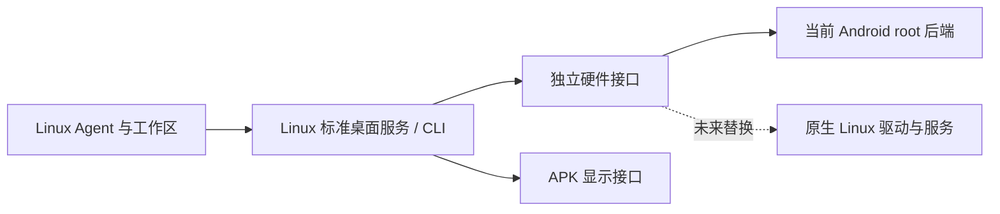

# Linux 服务与独立手机硬件后端（2026-10-05）

这轮改动以未来独立 Linux 发行版为边界：Agent、任务和工作区由 Linux 管理，Android 是当前的硬件后端，显示 APK 可以断开。不是另起一个同 APK UID 的子进程；那仍会随应用被强停或被冻结。

## Independent startup and recovery (2026-10-06)

The display app is a client. After the account has been configured and Android's
shared storage becomes available following the first unlock, Linux starts without
opening an Activity. Magisk's asynchronous `service.d` launcher calls
`rungic-runtime boot`; both the initial installation and subsequent releases
install that launcher. No installation, account setup, SMS or call is replayed.
An explicit `rungic-plasma stop` persists a disabled marker across boots;
`rungic-plasma start` restores supervision after the desktop becomes ready.

`rungic-runtime` holds a private lock outside app freezer groups. It only starts a
missing container through the serialized `boot-start` action. It never resets a
failed user service or restarts a healthy desktop. An unavailable state query is
retried without starting or stopping Linux. Native `lxc-info` skips client bind
sources, so missing APK files cannot masquerade as a dead container. Five successive unsuccessful
starts or short-lived container exits exhaust its budget; delays are 3, 12, 27,
30 and 30 seconds, and each start has a 180-second deadline. A container must remain
running for five minutes to reset the budget. Waiting for Android's first unlock
does not consume that budget. Explicit start is required after exhaustion.

Linux systemd continues to manage the desktop and Agent. The three critical user
units receive a five-start limit within five minutes and five-second restart
delays. Hardware adapters retain their own supervisors. `android-media` is an
optional entry reserved for the separate media migration; its implementation is
not included here. A hardware adapter's failed start is recorded without stopping
Linux. The independent network work in PR #43 keeps its existing `start_container`
hook; this branch does not implement another network forwarder.

KWin's Android backend now supports its **first** start without a display host.
It opens Linux's render device and creates one configured phone output with its
render loop inhibited. Host windows and presentation layers are created on the
first successful connection using the existing reconnect path. The session no
longer waits for the host socket before launching Plasma. The ordinary nested
Wayland backend still requires its upstream compositor. Package dependency
`kwin-wayland >= 4:6.6.6-0ubuntu0.1+rungic12~` prevents combining this session script
with an older backend. This is not a change to the stock display or input drivers.

The existing configurable container memory budget remains authoritative: 4 GiB
by default, RAM plus swap limited to 1.25 times the selected value. A root Linux
health service checks the current systemd MainPID of KWin, Plasma and the Agent
and applies `oom_score_adj=-250` to those UID 1000 main processes and KWin's
direct compositor child (the main process is its upstream restart wrapper). The
child must have the exact `/usr/bin/kwin_wayland` executable and the current wrapper
as parent. It
preserves any existing stronger protection. An open proc-file handle and a second
MainPID check prevent PID reuse from redirecting the write. Other applications
and worker processes receive no new OOM exemption. This improves memory reclaim
priority; it does not prevent an explicit SIGKILL or guarantee survival under
memory exhaustion, and no Moto-wide exemption is installed.

Persistent evidence contains lifecycle metadata only:

- `state/host/runtime/host.log` and its previous file: boot identifier, container
  start/exit, retry state, exit code and memory cgroup counters.
- `state/host/runtime/linux.log`: systemd MainPID, selected compositor PIDs, active state, restart count,
  result and last main-process exit code. The health timer runs every 30 seconds; package configuration starts only this
  new timer on live upgrades and respects an administrator's disabled state.
- Each critical unit's ExecStopPost callback writes a separate private log under
  `$XDG_STATE_HOME/rungic` (default `~/.local/state/rungic`). Separate files avoid
  concurrent callbacks racing rotation. Journald retains its existing limits.

Logs rotate around 64 KiB and retain one previous file. They contain neither
request bodies nor process environments. A SIGKILL status or OOM counter alone
does not identify the killer; attribution still needs matching kernel/Android
exit evidence. A killed supervisor cannot record its own final signal, but its
last boot/state record remains available after a subsequent explicit start.

### Upstream selection and validation

Reuse [Magisk's late-start service scripts](https://topjohnwu.github.io/Magisk/guides.html)
(the existing runtime is v31.0, GPL-3.0) and
[systemd service restart/exit hooks](https://github.com/systemd/systemd/blob/v259/man/systemd.service.xml)
(LGPL-2.1-or-later) instead of an app watchdog or a vendor-specific global killer
bypass. The only host supervisor is the Android/LXC boundary; service policy stays
in Linux. KWin remains pinned to Ubuntu 6.6.6 in `packages/kwin/recipe.json`, with
GPL-2.0-or-later changes carried as a patch queue, including safe cleanup when a
first connection never created an event thread. No new third-party daemon or
unversioned binary is introduced.

Offline sandbox tests execute the real boot supervisor and controller through
fake platform boundaries: prerequisites, healthy-container preservation, local
hardware failure, five-attempt exhaustion, rapid exits, explicit stop/start,
freezer rejection, bounded logs, metadata-only exit callbacks and selective OOM
protection. Patch-queue verification checks the reconstructed source.

The native ARM64 build on Mac mini passed. The standalone Linux system test
`tools/system/desktop_without_host.py` runs the actual newly built Android backend
in software mode, without Android, against its own headless host and Qt editor.
It starts the editor with unsaved text before any host exists, then checks the
first attachment and two host losses/reconnections while retaining the same
compositor/editor processes and text. Invoke it with
`RUNGIC_KWIN_BINARY=/path/to/new/kwin_wayland`; a raw build may also need
`QT_PLUGIN_PATH=/path/to/build/bin`. It is separate from the generic stock-KWin
system image because that image does not carry the Android backend patch queue.

**Device acceptance remains required:** cold boot followed by first unlock
without opening the display APK; phone GPU allocation, first display attachment
and touch/IME; backend fault isolation; APK force-stop during a task; explicit
stop across a boot; unplugged background overnight; and compatibility with the
separate network/media changes. No phone runtime, user desktop or power policy
was modified to obtain the above results. The feature remains experimental until
these checks run against one complete deployed candidate.

## Earlier hardware-service split (2026-10-04/05)

The following records describe the preceding change and its device evidence.

## 能力的归属

| 能力 | 本轮前 | 本轮 | 原生发行版的替换方向 |
| --- | --- | --- | --- |
| 用户、文件、D-Bus、APT、SSH、应用、Agent 工作区 | Linux；默认 KWin `--virtual`，已独立 | 保留现有归属 | Linux systemd、文件系统、桌面协议 |
| Agent 执行 / Codex app-server / 任务 | Linux 用户服务，但 `PartOf=graphical-session.target` | `default.target` 常驻；UID 1000 的用户管理器 linger；启动时直接读取登录/代理环境 | Linux 用户服务；语音输入和屏幕只是客户端 |
| Wi-Fi / 默认网络与 DNS、蓝牙、SIM 状态、短信 | Android API 在显示 APK 的平台桥里 | Linux 直连 root `DeviceDaemon`，独立 socket 和事件 epoch | NetworkManager / BlueZ / ModemManager；按接口替换后端，不能与 Android 同时争用同一硬件 |
| 剪贴板 | 已有 UID 2000 ClipboardDaemon | 保留，不重造 | Wayland / XDG 桌面服务 |
| 通话 | 已有 root CallDaemon；`InCallService` 仍属 APK | 保留，只迁 SIM 状态与短信 | ModemManager + 通话服务；不能把现有电话链路称为完全脱离 APK |
| 扬声器 | Termux PulseAudio / OpenSL ES 后端已独立 | 保留 | ALSA / PipeWire |
| 麦克风、相机 | APK CaptureBridge / CaptureService | 未迁移 | ALSA / PipeWire / libcamera；先核对权限与真实采集 |
| 硬件视频 | Linux V4L2 主路径；APK MediaCodec 后备 | 未迁移 | V4L2 / GStreamer / FFmpeg；不能把后备路径称为已独立 |
| 手机画面、触摸、输入法、方向、投屏显示、OCR | APK / Android 宿主 | 仍走显示端点；KWin 重连由另一个 PR 处理 | DRM/KMS、libinput、桌面输入协议、共享 OCR |
| CPU 唤醒 / Linux 资源上限 | 已有 root busy 唤醒锁、LXC 限额 | 复用；不扩大为整机永不休眠 | systemd / 内核电源和资源管理 |
| 冷启动与整机恢复 | Android/Magisk 和现有首装控制器 | 本轮不新增整机开机自动恢复或厂商豁免 | 发行版 init 与有界健康恢复 |

APK 的后台保护、KWin 显示重连、独立硬件服务是不同工作。当前容器仍需要既有 Android/Magisk 引导；此 PR 不把“已有容器的 Agent 独立启动”当作“整机开机后无需 Android 初始化”。

## 两个端点，保持操作契约

- 硬件：抽象 Unix socket `com.rungic.device.v1`，与 LXC 共用网络命名空间。`network-get`、`wifi`、`network-wifi`、`bluetooth`、`telephony`、`sms`、`container-memory`、`screen-timeout`、`desktop-boost`、`device-status` 及只含 network/telephony/bluetooth 的 watch。
- 显示：原 `/mnt/android-wayland/platform.sock`。画面/输入/相机等操作以及混合 watch 保留原路径；APK 将旧硬件请求转发给独立端点，并把硬件事件接入其兼容 watch。
- `shared/platform/rungic_platform_transport.py` 共用 JSON 行、大小/时间上限和错误处理。`RUNGIC_DEVICE_SOCKET` 可指定替代后端；明确配置的旧 `RUNGIC_PLATFORM_SOCKET` 仍能用于旧设备和契约替身。没有运行中自动回退。
- 每个请求只提交一次。超时、半个回复或连接丢失都不重试，也不改投 APK；尤其不能因短信结果不确定而再发一次。后端忙时在执行前明确返回错误。
- 默认硬件 socket 的客户端核对服务 UID 0 后才发送数据；服务只接受 UID 0、1000 和当前 APK UID。APK 转发也核对 root 对端。显式指定的测试/替代端点属于配置者的信任边界。

## Android 16 进程与短信回调

复用项目 ClipboardDaemon / CallDaemon 的 `app_process` 启动方式以及 scrcpy 的进程独立思路。代码仍随 APK 分发，root 看守从已安装 APK 读 classes；执行 UID、cgroup 和寿命独立，不能把代码打包位置当作进程归属。

root `app_process` 不经过应用 Zygote 的 telephony / Bluetooth 初始化，也没有 AMS 的应用记录。因此直接用普通 Activity Context 的三条路径都不能照搬：

1. 显式初始化框架的 telephony / Bluetooth service manager，Context 采用系统框架加 `com.android.shell` 的包归属与实际 UID 0 attribution。没有伪造应用 UID，也不动态查询或硬编码厂商 Binder 事务号。
2. SMS 查询通过 AMS `getContentProviderExternal("sms", user 0, token, tag)` 和 `ContentProviderClient`；只做查询，finally 释放 external token，释放失败不隐藏。读取仍不标记已读。
3. 普通应用广播 PendingIntent 在该 root 进程中未收到回调。改为进程自身实现的 `IIntentSender.send`，用公开 PendingIntent Parcel 入口传给 SmsManager；AMS 明确支持非 PendingIntentRecord 的直接目标。每个 token 在后台固定用途和分段序号，填入的 `part` 不改变它；只有 framework/radio 身份接受，超时关闭后晚到回调无效，重复回调由原 SmsState 去重。送达仍须有效状态报告 PDU，合成广播或 RESULT_OK 不被当作送达。

查阅来源：AOSP `android16-release` 的 [ActivityManagerService.sendIntentSender](https://android.googlesource.com/platform/frameworks/base/+/refs/heads/android16-release/services/core/java/com/android/server/am/ActivityManagerService.java)、[IIntentSender.aidl](https://android.googlesource.com/platform/frameworks/base/+/refs/heads/android16-release/core/java/android/content/IIntentSender.aidl)、[PendingIntent.java](https://android.googlesource.com/platform/frameworks/base/+/refs/heads/android16-release/core/java/android/app/PendingIntent.java)（Apache-2.0）；[scrcpy](https://github.com/Genymobile/scrcpy)（Apache-2.0）的独立 Android server 模式。没有复制上游源码进产品；本轮小型适配层是 MIT。隐藏框架 API 是维护边界：固件升级后须重新跑探针，不把 Android 16 的结果推广到其他版本。

## 看守、启动与记录

`system/android-device` 由既有 root 控制器 start/restart 启动，stop 显式停止。新文件同时进入 host seed 和 release Android 文件清单，已有安装不能只升级 Linux deb：还需配套 APK 2.36 和控制器文件。

- supervisor 在 fork JVM 前只把自己移出继承的 APK UID freezer cgroup，随后 JVM 继承；不移动其他 APK 或容器进程。无法移出则拒绝启动。
- 单个后台看守用私有 flock 防并发；PID 停止前检查精确类命令，防旧 PID 被其他程序复用。
- 连续 5 次快速失败停止自动恢复，间隔 3/12/27/30 秒；运行满 60 秒才重置快速失败计数。必须明确 start 再恢复。看守不重启 LXC 或健康工作区，不保存或重放提交。
- `state/host/device/lifecycle.log` 有界轮转（当前约 64 KiB + 前一份），只记启停/时长/退出码；不记电话号码、短信、网络凭据。该目录位于现有持久 host state。
- Linux journald 改为 persistent，32 MiB 总上限、8 MiB 单文件、7 天保留，便于区分上一轮服务退出。不能补回已经丢失的夜间历史日志，也不记录 API key。

本轮不新增通用 Magisk 开机看守、不改 Moto 白名单，不保证 OOM 或整机休眠下任何进程永远存活。Agent 忙时防整机休眠复用已有 busy wakelock；空闲时允许睡眠。root 不是内核内存隔离。

## 验收

开发机 mibook / x86_64，Mac mini ARM64 仅用于另一个 KWin PR 的开发覆盖；本 PR 未安装到手机的生产路径。

临时只读探针在 USB G100 `ZY32M9MRVP` / Android 16 `W1VT36H.1-51-8` / SELinux Enforcing 上以 Magisk root 运行，用候选 classes.dex，不安装 APK、不发短信、不切换网络：

- telephony/Bluetooth framework 初始化、网络状态、网络事件注册、SIM 和蓝牙读数、外部 SMS provider 查询与释放通过。
- 合成 sent callback、合成 GSM status-report PDU callback 通过；另测 token 跨 Parcel、分段绑定、重复/失败回调、不合法回执和关闭后的晚到回调。不是新的真实无线电发送或运营商回执验收。
- 候选 DeviceDaemon 的实际命令行和 cgroup 已核对：UID 0；memory `/apps`（没有 APK `/uid_...`）、cpuset/cpu/blkio/unified 根组。不能仅凭 `setsid` 宣称脱离 freezer。
- Linux 真实 socket / 对端身份、请求大小与不确定结果不重放、后台与显示路由、bounded supervisor / inherited-app-cgroup 拒绝、Agent 单元生命周期和无 DISPLAY 启动在离线回归中验证。
- 临时实际 DeviceDaemon PID 13339 由 Linux UID 1000 连接，核对 socket 对端 UID 0。另一个 KWin PR 的 20 次 APK 强停重连以及超过 35 秒断开、熄屏轮次中，该 PID 与 epoch 保持不变。此证据只证明候选后台进程的独立寿命；看守和新 Agent 用户服务尚未装入生产路径，不能据此算作完整部署验收。

真实 root SmsManager 提交、长短信/多 SIM/运营商结果、后台网络写入、实际用户管理器跨图形会话的任务连续性仍待配套版本部署验收。整夜待机：USB G100 上的 20261005.5 接电源、Plasma 停在前台熄屏，19 小时 54 分后桌面、Agent、独立硬件后台和未保存文本都还在，亮屏后触摸和输入正常（2026-10-06，mibook，release/history.json）；不接电源、Plasma 先切到后台的整夜待机还没验。既有 APK 2.32 的 10000 实机结果见 [docs/107](107-android-sms.md)，不冒充这个新 backend 的发送结果。夜间整容器被杀的根因仍未证实；此 PR 解决可观察的依赖，不宣称已修复全部夜间问题。

最终离线回归：112 项通过；`DeviceBuildTests.test_library_dependencies_and_debug_symbols_by_build_id` 在 Fedora 本机得不到 Debian `libc6` 依赖字段，同一未改 main `c9d549ce` 精确复现，列为既有构建环境限制。完整 Java / D8 / APK 2.36 构建和 shell 语法检查通过，严格功能清单 162 功能、0 错误、44 项既有仅设备缺口。

## APK 2.38 兼容入口回归（2026-10-05 USB G100）

统一 dev 20261005.3（main `68f640aa`、APK 2.37/85）首次完整部署后，Linux UID 1000 直连生产 root DeviceDaemon 的网络、蓝牙、SIM、短信读取及 watch 可用，三个旧平台桥契约却失败。实际 Android 16 小探针确认：新 LocalSocket 在 connect 前调用 setSoTimeout 抛 `IOException: socket not created`，connect 后设置通过。APK 的普通请求与硬件事件监听都误用了这个顺序；2.38/86 把两处都改为先连接，再设置超时并核对服务 UID。

USB 安装候选 APK 2.38 后，`contract.network`、`contract.bluetooth`、`contract.telephony` 全部通过；旧平台桥 watch 返回 network/telephony/bluetooth 的版本均为 2，确认 APK 的事件转发也工作。原生库和 OCR 资源沿用并逐文件核对 20261005.3 的内容。DeviceProbe 增加实际 AndroidDeviceBridge 的只读请求回归，须有运行中的 DeviceDaemon；不是新的短信发送验收。

同次升级还发现旧系统仅保留 plasma-workspace.target 的 Agent 启用链接，新 default.target 链接缺失，虽然 deb-systemd-helper 的记录已经包含它。包的 postinst 对原本已启用的服务刷新 WantedBy 链接；主动禁用或屏蔽的服务不重新启用，也不修改离线 DPKG_ROOT 或卸载状态。USB 补齐链接后 WantedBy 含 default.target，UID 1000 Linger=yes，Agent 未被重启。26 项后端、单元、启用迁移和容器控制回归通过；修复后的 USB 候选组合通过全部 19 项 smoke（含摄像头帧、音频读写和输入）。完整部署与待机记录另按最终统一发布版本登记，不能把候选 APK 与 .3 清单混算为 .3 全部通过。
